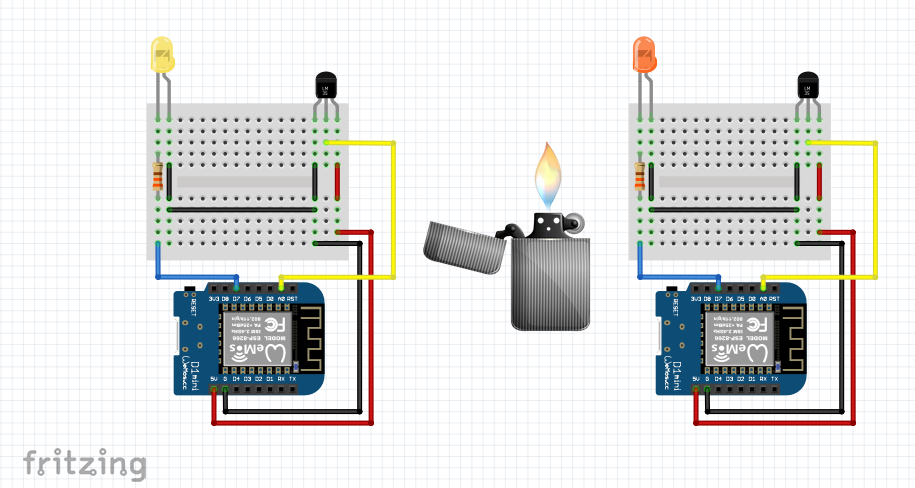

# Estudando o protocolo TCP no Node MCU

  Trabalho proposto nas Atividades Integradoras V(5º Período) do curdo de Ciência da Computação pelos professores Celso e Wesley, integrando as disciplinas de Sistemas Embarcados e Redes de Computadores, respectivamente.
  
  O objetivo deste trabalho foi estudar os princípios do protocolo TCP, cujo qual devolve uma mensagem do receptor para o transmissor informando que o pacote foi recebido com sucesso. 
  
  O presente trabalho consiste em dois dispositivos ESP8266, um deles atuando como servidor, e o outro com cliente. O Cliente e o Servidor trocam mensagens entre si enviando os valores referentes à temperatura do sensor LM35 ao qual administram. Aquele dispositivo que estiver com o maior valor de temperatura irá acender, contudo, somente se a discrepância de valores for superior a 2ºC(dois graus celsius).
  
##### Para o desenvolvimento deste trabalho foram utilizados
- 2 dispositivos Node MCU ESP8266;
- IDE Arduino 1.6.9
- Módulo esp8266 2.4.1 by ESP8266 Community 

#### Imagem do esquemático:

 
